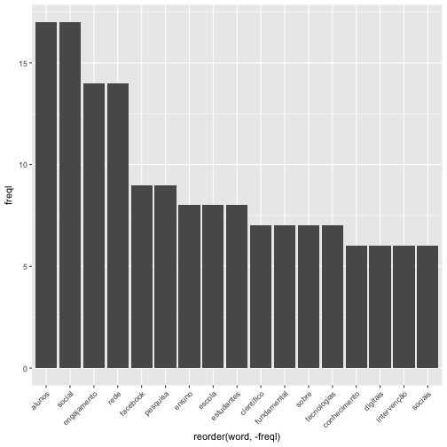
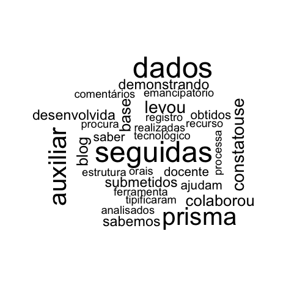

Mineração de Texto em R
========================================================
author: Fabio Gomes Rocha
date: 
autosize: true
transition:rotate
<small> 
I &nbsp;&nbsp;&nbsp;CONGENTI <br />
Universidade Tiradentes
</small>

Agenda
========================================================
transition:rotate
- O que é o R?
- O que posso fazer com o R?
- Iniciando em R
- Mineração de texto
- Minerando texto no R
- Mão na massa

O que é o R?
========================================================
transition:rotate
- 1993: Projeto de pesquisa em Auckland, na Nova Zelândia
- 1995: R liberado como projeto open-course
- 1997: Formado o grupo R-Core
- 2000: Liberada a versão 1.0.0 do R
- 2003: Criação da R Foundation
- 2004: Primeira conferência internacional de usuários em Vienna
- 2015: Formado o R Consortium (com participação da IBM e Microsoft)

O que posso fazer com o R?
========================================================
transition:rotate
- Extração de Dados
- Limpeza de Dados
- Carregamento e Transformação de Dados
- Análise Estatística
- Modelagem Preditiva
- Machine Learning
- Visualização de Dados
- Processamento de imagens [...]

Iniciando em R
========================================================
transition:rotate
> - getwd() --> Exibir diretório de trabalho
> - setwd('/Users/pmm/R_Doutorado/Curso de R') --> fixar diretório
> - print('R - Uma das principais ferramentas do Cientista de Dados') --> imprimir
> - plot(1:30) --> gerar gráfico
> - hist(rnorm(10)) --> Gerar grafico histograma
> - install.packages('randomForest') --> instalando pacote
> - library(ggplot2) --> carregando pacote
> - variável = valor --> criando variáveis

Iniciando em R
========================================================
transition:rotate
Usando o if/else

```r
x = 7
if (x < 7) {
  "Este numero eh menor que 7"
} else if(x == 7) {
  "Este é o numero 7"
}else{
  "Este numero nao eh menor que 7"
}
```

```
[1] "Este é o numero 7"
```


Iniciando em R
========================================================
transition:rotate
Usando o ifelse

```r
x = 5
ifelse (x < 6, "Correto", NA)
```

```
[1] "Correto"
```

Iniciando em R
========================================================
transition:rotate
Usando o Repeat

```r
x = 1
repeat {
  x = x + 3
  if (x > 10)
    break
  print(x)}
```

```
[1] 4
[1] 7
[1] 10
```


Iniciando em R
========================================================
transition:rotate
Usando o For

```r
for (i in 1:7) {print(i)}
```

```
[1] 1
[1] 2
[1] 3
[1] 4
[1] 5
[1] 6
[1] 7
```

Iniciando em R
========================================================
transition:rotate
Usando o While

```r
y = 2
while(y < 5){
  y = y+10
  print(y)
}
```

```
[1] 12
```

Iniciando em R - String em R
========================================================
transition:rotate

```r
texto <- "Isso eh uma string!"
texto
```

```
[1] "Isso eh uma string!"
```

```r
x = as.character(3.14) 
class(x) 
```

```
[1] "character"
```

Iniciando em R - String em R
========================================================
transition:rotate

```r
nome = "Joselito"; sobrenome = "Silva" 
paste(nome, sobrenome)
```

```
[1] "Joselito Silva"
```

```r
cat(nome, sobrenome)
```

```
Joselito Silva
```

Iniciando em R - String em R
========================================================
transition:rotate

```r
texto <- "Isso eh uma string!"
substr(texto, start=13, stop=18) 
```

```
[1] "string"
```

```r
?substr
```

Iniciando em R - String em R
========================================================
transition:rotate

```r
nchar(texto)
```

```
[1] 19
```

```r
tolower(texto)
```

```
[1] "isso eh uma string!"
```

```r
toupper(texto)
```

```
[1] "ISSO EH UMA STRING!"
```


Mineração de texto
========================================================
transition:rotate
<br /><p /><br />
Mineração de textos (Text Mining) é um Processo de Descoberta de Conhecimento, que utiliza técnicas de análise e extração de dados a partir de textos, frases ou apenas palavras
<br />
>A base de dados textuais é conhecida como corpora, sendo que cada um dos elementos de um corpora é tratado como um documento. 
>O corpus é representado por: Corpus = {doc1, doc2, ..., docn}

Mineração de texto
========================================================
transition:rotate
<br /><p /><br />
O corpus precisa ser preparado, exemplo de corpus:
> Corpus = {doc1, doc2, ..., docn} 
<br>
> doc1 = "Estamos no I Congenti na Universidade Tiradentes fazendo o curso de Minerando texto em R"<br>
> doc2 = "No segundo e terceiro dia do Congenti ocorreu palestras de tecnologia e no quarto dia teremos apenas oficina, entre elas a de Minerando texto em R"

Mineração de texto
========================================================
transition:rotate
<br /><p /><br />
Criando tokens com base no corpus doc1 e doc 2
> doc1 = Estamos| no| I |Congenti | na | Universidade| Tiradentes| fazendo| o |curso| de |Minerando| texto| em | R
<br>
> doc2 = No| segundo | e | terceiro |dia |do |Congenti | ocorreu | palestras | de | tecnologia | e | no | quarto | dia | teremos | apenas | oficina| , | entre |elas | a | de| Minerando | texto|  em | R

Mineração de texto
========================================================
transition:rotate
<br /><p /><br />
Limpando palavras comuns (remoção de Stopwords)
> doc1 = Estamos |Congenti | Universidade| Tiradentes| fazendo| curso| Minerando| texto|  R
<br>
> doc2 = segundo | terceiro |dia |Congenti | ocorreu | palestras | tecnologia | quarto | dia | teremos | apenas | oficina| Minerando | texto|   R

Mineração de texto
========================================================
transition:rotate
Dicionário de termos obtidos
> termo 1 = Estamos   | termo 2 = Congenti
<br>
> termo 3 Universidade | termo 4 Tiradentes
<br> 
> termo 5 fazendo | termo 6 curso
<br> 
> termo 7 Minerando | termo 8 texto
<br> 
> termo 9 R | termo 10 segundo 
<br> 
> termo 11 terceiro | termo 12 dia 
<br> 
> termo 13 Congenti | termo 14 ocorreu 
<br> 
> termo 15 palestras |  termo 16 tecnologia 
<br> 
> termo 17 quarto |  termo 18 dia 
<br> 
> termo 19 teremos |  termo 20 apenas 
<br> 
> termo 21 oficina |termo 22 Minerando 
<br> 
> termo 23 texto |  termo 24 R

Mineração de texto em R
========================================================
transition:rotate
Construindo um corpus

```r
library(tm)
docs = VCorpus(DirSource("/Users/pmm/R_Doutorado/textos/", encoding = "UTF-8"), readerControl = list(reader=readPlain, language="por"))
summary(docs)
```

```
                Length Class             Mode
palavras chaves 2      PlainTextDocument list
texto           2      PlainTextDocument list
titulos         2      PlainTextDocument list
```

Mineração de texto em R
========================================================
transition:rotate
Exibindo informações

```r
inspect(docs[1])
```

```
<<VCorpus>>
Metadata:  corpus specific: 0, document level (indexed): 0
Content:  documents: 1

[[1]]
<<PlainTextDocument>>
Metadata:  7
Content:  chars: 282
```

Mineração de texto em R
========================================================
transition:rotate
Exibindo informações

```r
writeLines(as.character(docs[1]))
```

```
list(list(content = c("Covariação; Estruturas multiplicativas", "Escrita. Reescrita. Perspectiva Histórico-cultural. Rede Social. Facebook.", "Educação Sociocomunitária, Letramento Científico, Clube de Ciências.", "Redes sociais digitais;Engajamento comportamental; Engajamento cognitivo", "Rede social; Sala de aula; TIC"), meta = list(author = character(0), datetimestamp = list(sec = 36.5141689777374, min = 57, hour = 13, mday = 23, mon = 10, year = 117, wday = 4, yday = 326, isdst = 0), 
    description = character(0), heading = character(0), id = "palavras chaves", language = "por", origin = character(0))))
list()
list()
```

Mineração de texto em R
========================================================
transition:rotate
Pré-processamento

```r
docs <- tm_map(docs,removePunctuation) 
docs <- tm_map(docs, removeNumbers)
docs <- tm_map(docs, tolower)   
docs <- tm_map(docs, removeWords, stopwords("portuguese"))
docs <- tm_map(docs, stripWhitespace)
docs <- tm_map(docs, PlainTextDocument)
```

Mineração de texto em R
========================================================
transition:rotate
Pré-processamento

```r
dtm <- DocumentTermMatrix(docs)   
dtm  
```

```
<<DocumentTermMatrix (documents: 3, terms: 531)>>
Non-/sparse entries: 570/1023
Sparsity           : 64%
Maximal term length: 21
Weighting          : term frequency (tf)
```

Mineração de texto em R
========================================================
transition:rotate
Pré-processamento

```r
tdm <- TermDocumentMatrix(docs)   
tdm   
```

```
<<TermDocumentMatrix (terms: 531, documents: 3)>>
Non-/sparse entries: 570/1023
Sparsity           : 64%
Maximal term length: 21
Weighting          : term frequency (tf)
```

Mineração de texto em R
========================================================
transition:rotate
Processamento

```r
freq <- colSums(as.matrix(dtm))   
length(freq)   
```

```
[1] 531
```

```r
ord <- order(freq)   
m <- as.matrix(dtm)   
dim(m)
```

```
[1]   3 531
```


Mineração de texto em R
========================================================
transition:rotate
Processamento

```r
head(table(m), 20) 
```

```
m
   0    1    2    3    4    5    6    7    8    9   11   13   17 
1023  423   78   33   13    8    4    4    2    1    1    2    1 
```

```r
tail(table(m), 20) 
```

```
m
   0    1    2    3    4    5    6    7    8    9   11   13   17 
1023  423   78   33   13    8    4    4    2    1    1    2    1 
```

Mineração de texto em R
========================================================
transition:rotate
Processamento

```r
freqw <- colSums(as.matrix(m))   
freqw 
```

```
                  "",            "ciências”          "comunicação 
                    4                     1                     1 
        "conhecimento      "considerações")           "construção 
                    1                     1                     1 
             "digital             "educação              "escrita 
                    1                     1                     2 
             "espanto          "fundamental                "nesta 
                    1                     1                     1 
              "pretto                 "rede                "redes 
                    1                     1                     1 
           "sustentar           "utilização                “clube 
                    1                     1                     1 
        “comentários”            “curtidas”               abarcou 
                    1                     1                     1 
               aborda             abordagem                  ação 
                    1                     2                     2 
                ações        acompanhamento              aconteça 
                    2                     1                     1 
             acontece             aconteceu                adotou 
                    1                     1                     1 
                ainda                ajudam                  além 
                    1                     1                     3 
                aluno            alunoaluno                alunos 
                    5                     1                    17 
            ambiental              ambiente             ambientes 
                    1                     1                     1 
           analisados              analisar               análise 
                    1                     2                     4 
             análises                   ano                 ano", 
                    1                     2                     1 
                 anos                 antes                apenas 
                    1                     1                     1 
            aplicação             aplicados            aplicativo 
                    1                     2                     1 
          apoiandonos                 apoio             apontaram 
                    1                     3                     1 
                 após              aprender          aprendizagem 
                    1                     1                     3 
       aprendizagem",           apresentada          apresentaram 
                    1                     1                     1 
         apresentouse           aproximação                  área 
                    1                     1                     1 
           argumentos              aspectos                 assis 
                    1                     2                     1 
              assunto            atividades               através 
                    1                     5                     1 
                 aula                aula")                 aulas 
                    3                     1                     3 
             auxiliar           bakhtiniana                  base 
                    1                     1                     1 
              baseado                básica                básico 
                    1                     1                     1 
                  bem             bimestres                  blog 
                    1                     1                     1 
                busca                   c("         c("covariação 
                    2                     1                     1 
       c("engajamento                 cacoo                  cada 
                    1                     1                     2 
              caderno              campinas                 campo 
                    1                     1                     3 
      características                  caso                 ceará 
                    2                     1                     2 
            centrouse             cidadania               cidadão 
                    1                     1                     1 
              ciência              ciências            ciências", 
                    2                     2                     1 
           científico                 clube             cognitivo 
                    7                     4                     3 
          cognitivo",           colaborando         colaborativas 
                    1                     1                     1 
            colaborou                coleta           comentários 
                    1                     1                     4 
           comparados        compartilhados     compartilhamentos 
                    1                     1                     1 
       comportamental           compreender           compreensão 
                    4                     2                     5 
           computador           comunicação         comunitária", 
                    1                     2                     1 
          comunitário              conceito             conceitos 
                    2                     3                     1 
           conceitual                conduz          confessional 
                    1                     1                     2 
             conhecer            conhecidas          conhecimento 
                    2                     1                     6 
        conhecimentos            considerar           constatouse 
                    3                     1                     1 
         constituição            construção                 conta 
                    1                     3                     1 
             conteúdo             conteúdos              contexto 
                    1                     2                     2 
            contextos         contribuições            contribuir 
                    1                     3                     2 
         contribuíram              controle             cotidiana 
                    1                     1                     1 
            cotidiano            covariação                criado 
                    1                     5                     1 
              criavam                cristã               crítico 
                    1                     1                     2 
                 cujo               cultura             cultura", 
                    1                     2                     1 
            currículo              curtidas                 dadas 
                    1                     1                     1 
                dados          demonstrando                dentre 
                    4                     1                     1 
               dentro           depoimentos              desafios 
                    1                     1                     1 
               desejo            desempenho           desenvolver 
                    1                     2                     1 
         desenvolvida         desenvolvidas       desenvolvimento 
                    2                     1                     2 
            despertam                 dessa                dessas 
                    1                     1                     2 
                desta            destacaram                 deste 
                    3                     1                     1 
               destes                devese          diagnosticar 
                    1                     1                     1 
               diante               diários              didática 
                    2                     1                     1 
        diferenciados              digitais   digitaisengajamento 
                    1                     6                     1 
         digitaisok",               digital              dinâmica 
                    1                     2                     1 
             discente             discentes           disciplinas 
                    5                     1                     1 
             discurso            discussões            discutidas 
                    1                     2                     1 
           discutimos                 disso              diversos 
                    2                     2                     1 
             dividida               docente                  dois 
                    2                     1                     2 
                dupla               duração               durante 
                    1                     1                     4 
             educação              eficácia            elaboração 
                    2                     1                     1 
           elaboradas              eletivas         emancipatório 
                    1                     1                     1 
              emprego             encontros           engajamento 
                    1                     2                    14 
             enquanto                ensino              ensino", 
                    1                     8                     1 
   ensinoaprendizagem             enunciado          envolvimento 
                    1                     1                     1 
         equilibrando                escola              escola", 
                    1                     8                     1 
              escolar             escolar",               escrita 
                    1                     1                     3 
              espaços              esquemas           estabelecer 
                    1                     1                     1 
        estabelecidas                estado               estarem 
                    1                     3                     1 
     estatisticamente           estratégias             estrutura 
                    1                     1                     1 
           estruturas            estudantes                estudo 
                    2                     8                     3 
              estudos                 etapa                etapas 
                    1                     1                     1 
             evolução             evoluções              execução 
                    1                     1                     1 
          experiência          experimental           explicações 
                    1                     1                     1 
              exposto              facebook            facebook", 
                    1                     9                     2 
              fatores                 fazem                feitas 
                    1                     1                     1 
               feitos            ferramenta             filosofia 
                    1                     2                     1 
               finais               fizemos                 forma 
                    1                     1                     2 
             formação                formas             fortaleza 
                    3                     1                     1 
                fotos            frequência          fundamentado 
                    1                     2                     1 
          fundamental              geogebra              gráficos 
                    7                     1                     1 
                grupo                grupos     históricocultural 
                    4                     1                     2 
                 hoje              horários           hortolândia 
                    1                     1                     1 
        identificadas         identificamos           identificar 
                    1                     1                     1 
            inclusive             indicador             indicaram 
                    1                     1                     1 
              indicou       individualmente            informação 
                    1                     1                     2 
             inserção             inseridas              inserido 
                    1                     1                     1 
         instituições              integral             interação 
                    1                     1                     1 
             interior         interpretação           intervenção 
                    1                     1                     6 
         intervenções           invariância          investigação 
                    1                     1                     4 
         jornalístico           justificase               leitura 
                    1                     1                     1 
           letramento                  leva                 levou 
                    5                     1                     1 
             lineares                língua             linguagem 
                    1                     2                     1 
           localizada                 lugar               manteve 
                    1                     2                     1 
           matemática         matemáticos",                  meio 
                    2                     1                     4 
                meios                melhor                  mero 
                    1                     1                     1 
                meses                mesmos                método 
                    1                     1                     1 
          metodologia         metropolitana           mobilizados 
                    5                     1                     1 
          modificação                  modo               momento 
                    1                     1                     1 
            monitores              múltipla             múltiplas 
                    1                     1                     3 
      multiplicativas     multiplicativas",        multiplicativo 
                    1                     1                     1 
                mundo             municipal             município 
                    2                     2                     1 
           necessário           necessidade                 nesta 
                    1                     1                     2 
                neste                 norma            noticiário 
                    1                     1                     1 
                novas             novidades                 novos 
                    1                     1                     1 
             objetivo             objetivou                objeto 
                    2                     1                     1 
           observação              obtenção               obtidos 
                    1                     1                     2 
           ocorrência                  onde                online 
                    1                     2                     1 
                orais                padrão                 parte 
                    1                     2                     1 
         participação          participante         participantes 
                    2                     1                     1 
         participaram            particular              partindo 
                    1                     1                     1 
               partir                 paulo           pedagógicas 
                    3                     2                     2 
               perfil               permite            permitindo 
                    1                     1                     1 
          perspectiva          pertencentes              pesquisa 
                    2                     1                     9 
  pesquisaintervenção          planejamento                  pode 
                    1                     1                     3 
                podem                 porém                porquê 
                    1                     1                     1 
           portuguesa        posicionamento          possibilitar 
                    2                     1                     1 
               possui              postagem             postagens 
                    2                     1                     3 
             postavam              pósteste                postos 
                    1                     2                     1 
              postura              práticas               preciso 
                    1                     4                     1 
             premissa          prerrogativa           prescritivo 
                    1                     1                     1 
             presença              presente             presentes 
                    2                     3                     2 
         pressupostos              préteste                pretto 
                    1                     2                     1 
               prévio             principal        principalmente 
                    1                     2                     1 
             prioriza                prisma              processa 
                    1                     1                     1 
             processo             processos               procura 
                    3                     1                     1 
             produção             professor            professora 
                    5                     2                     1 
       professoraluno               projeto             promovido 
                    1                     4                     1 
            proporção            proporções              proposta 
                    3                     1                     1 
            propostas              proposto               próprio 
                    1                     2                     1 
              pública           publicações          publicitário 
                    1                     2                     1 
             pudessem           qualitativa          qualitativas 
                    1                     1                     1 
               quatro        questionamento            questionar 
                    1                     1                     1 
            realidade               realiza            realização 
                    1                     1                     1 
            realizada            realizadas             realizado 
                    1                     2                     3 
           realizados              recuerdo               recurso 
                    1                     1                     1 
             recursos                  rede                 redes 
                    1                    14                     5 
                redor             reescrita            reescritas 
                    1                     5                     1 
               refere           referenciar               referiu 
                    1                     1                     1 
             reflexão                região              registro 
                    2                     1                     3 
            registros                regras               relação 
                    1                     1                     2 
         relacionados           relacionais            relacionar 
                    1                     1                     1 
             relações            representa        representações 
                    1                     1                     3 
           resultados              reuniões               sabemos 
                    2                     2                     1 
                saber               saberes                  sala 
                    1                     2                     5 
             seguidas              seguindo              seguinte 
                    1                     1                     1 
              seleção                sempre                   ser 
                    1                     1                     1 
sereshumanoscommídias              serviram                  sido 
                    1                     1                     1 
         significação               simples              situação 
                    1                     1                     1 
            situações                   sob                 sobre 
                    3                     2                     7 
              sociais                social      sociocomunitária 
                    6                    17                     1 
             software                  sp",         subcategorias 
                    1                     1                     2 
           submetidos                sugere              superior 
                    1                     1                     1 
              suporte             suporte",                 surge 
                    1                     1                     1 
     sustentabilidade               tabelas                 tange 
                    1                     1                     1 
           tecnologia           tecnologias           tecnológico 
                    1                     7                     1 
                 teia                  tema                 tempo 
                    1                     1                     1 
                tendo        teoremasemação                teoria 
                    3                     1                     1 
             teóricos                textos               textual 
                    1                     4                     5 
                  tic                 tic")           tipificados 
                    1                     1                     1 
          tipificaram                  tipo                 tipos 
                    1                     1                     1 
                todos               tornase           trabalhando 
                    3                     1                     1 
             trabalho          tradicionais                 trata 
                    5                     1                     1 
                 três                 turma                turmas 
                    2                     1                     1 
                usada                usadas                usando 
                    1                     1                     1 
                  uso            utilização            utilizadas 
                    3                     1                     3 
         utilizaremos            utilizavam            utilizouse 
                    1                     1                     1 
             valoriza           verificando             verificar 
                    1                     1                     1 
                  vez                  vida                 vidas 
                    1                     1                     1 
               vídeos              virtuais                 vista 
                    1                     1                     2 
        visualizações              vivência              whatsapp 
                    1                     1                     1 
```

Mineração de texto em R
========================================================
transition:rotate
Processamento

```r
freql <- sort(colSums(as.matrix(m)), decreasing=TRUE)   
wf <- data.frame(word=names(freql), freql=freql)
library(ggplot2)   
p <- ggplot(subset(wf, freql>5), aes(x = reorder(word, -freql), y = freql)) +
  geom_bar(stat = "identity") + 
  theme(axis.text.x=element_text(angle=45, hjust=1))
head(wf)
```

```
                   word freql
alunos           alunos    17
social           social    17
engajamento engajamento    14
rede               rede    14
facebook       facebook     9
pesquisa       pesquisa     9
```
Mineração de texto em R
========================================================
transition:rotate
Processamento

```r
p
```



Mineração de texto em R
========================================================
transition:rotate
Processamento

```r
library(wordcloud)
wordcloud(names(freql), freq, min.freq=5)  
```



Mão na massa
========================================================
transition:rotate
- Construa um corpus
- Com base no corpus faça o grafico de frequencia
- Crie a nuvem de palavras

Obrigado
========================================================
transition:rotate
- https://github.com/gomesrocha/ProcessamentoTextoR
- http://www.fabiogomesrocha.com


